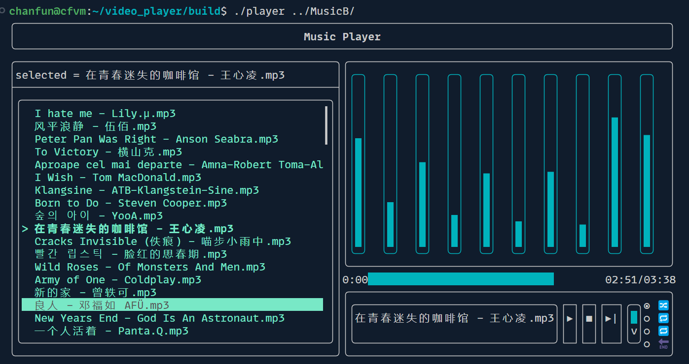

# 终端音乐播放器

TUI(终端)本地音乐播放器，支持鼠标键盘操作，实现以下播放器基本功能:

- 播放控制：播放，暂停，继续，终止，切换下一首
- 播放模式控制： 单曲循环，列表循环，随机播放，播放完当前列表停止
- 音量控制
- 播放列表
- 音浪模拟
- 播放进度条显示

效果如下：

## 依赖

- [ftxui](https://github.com/ArthurSonzogni/FTXUI)
- [libvlc](https://github.com/videolan/vlc)

## 编译运行

0. install ftxui, libvlc firstly.
1. `mkdir build && cd build `
2. `cmake ..`
3. `make`
4. `./player music_folder_path`