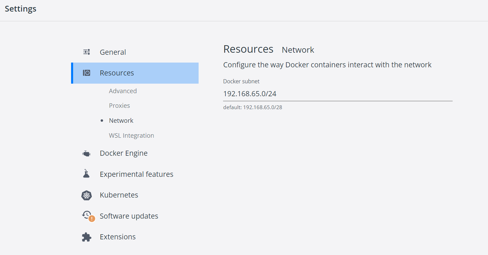

## 文档

**视图**：

1. 用例视图：
   - 描述系统的功能需求，找出用例和执行者
   - 描述使用的图：**用例图**，交互图，**活动图**，**状态图**
   - 重要性：系统中心，决定其他视图，用于确认和最终验证系统
2. 逻辑视图：
   - 描述如何实现系统内部功能
   - 描述使用的图：**类图和对象图**，**状态图**，**顺序图**，协作图，**活动图**
   - 重要性：系统静态结构以及发送消息而出现的动态写作关系
3. 实现视图：
   - 描述系统代码构件组织和实现模块
   - 描述使用的图：**构件图**
   - 重要性：如何划分软件构件，如何进行编程


## 职责划分->对象确立（静态分析）

功能职责划分 -> 确定对象实体

Client, MeataServer, ChunkServer（类图，对象图辅助）

### Client 

职责：

1. 提供用户基本 API
2. 从 Master 获取实际读写的 ChunkServer 地址。
3. 向 ChunkServer 发送实际的读写请求。

对象：

1. **Client**：

   属性：

   - vector[MasterServerCluster]
   - map[filename->ChunkServer]
   - clientID

   方法：

   - Get()
   - Put()
   - Delete()
   - Stat()
   - Rename()
   - Mkdir()
   - List()
   - GetRWAddr()
   - ReqeustRW()

### MasterServer

职责：

1. 响应 Client 请求。（Get, Put, Delete, Rename, Stat, List, Mkdir）

2. 文件子系统: 负责文件目录树的管理，存储文件目录树的元数据。负责文件/目录的增删改查。

3. 当用户上传大文件时，将其切分为若干个 Chunk（Spliter），为每个 Chunk 分配一个 UniqueID

4. Chunk 管理：映射到对应 ChunkServers（HandelsMapper）。

5. ChunkServer 管理：

   - 负责 ChunkServer 的检活，接收 ChunkServer 上报的handles，容量等统计信息
   - 上下线管理 -> 副本迁移。

6. 副本维护：副本丢失检测机制/副本补全机制/副本迁移：

   - 根据 ChunkServer 上报的信息，检查是否有副本丢失。（不论 ChunkServer 宕机与否，都有可能发生副本丢失）。
   - 检测到副本丢失 -> 确定丢失的 ChunkHandleID，找到其他正常的 ChunkServer，向 ChunkServer 发送副本同步请求。
   - 副本迁移 -> 向 ChunkServer 发送副本同步请求。（迁移功能实际上是面向运维管理人员的，暂时可以不考虑）

7. 上述元数据持久化与同步：

   - 持久化存储模块

   - TODO 共识协议: MasterServer 容错。

对象：

1. **MasterServer**： 
   
   - response to clients
   - split file into chunks -> assgin ID
   - ID -> ChunkServers (mapper)
   
   属性：
   
   - vector\<ClientConns>
   - vector\<groupRaftMachines>
   - file_sys_ptr_
   - chunk_server_manager_
   - replica_cordinator_
   
   方法：
   
   - public ReplyClient();
   - private GenerateUniqueID();
   - private MapHandlesToServer();
   - private SyncClusters();
   
2. **FileSystem**：（聚合关系）
   
   - manage files/dirs
   
   属性：
   
   - file_tree_root_
   
   方法：
   
   - public PutFileNode();
   - public DeleteFileNode();
   - public UpdateFileMeta();
   - public GetFileMeta();
   - public ListDir();
   
3. **ChunkServerManager**:（聚合关系）
   
   - check heartbeat, get statistic info(capacity, handles...)
   - register, unregister
   
   属性：
   
   - map\<Handles, AliveServers\>
   
   方法：
   
   - public Register();
   - public Unregister();
   
4. **ReplicaCordinator**：（和 MeataServer 组合关系，但依赖于 ChunkServerManager）
   
   > 和 ChunkServerManager 联系较为紧密
   
   负责管理文件副本，监控它们的状态，并在有必要时向 ChunkServer 发送同步请求，以保证文件副本的完整性和可用性。它还可以根据系统的负载情况调整副本的数量，以优化系统性能。
   
   - lost copy dectection 
   - send CopySync request to ChunkServer
   
   方法：
   
   - public DetectLostReplicas();
   - public SendCopySyncCommand();
   
5. **MetaStore**:（组合关系）
   
   - persistent storage of the above metadata(filename_to_handleid_Map, file_dir_Tree)
   
   属性：
   
   - storage_eng_
   
   方法：
   
   - public Read();
   - public Write();
   - public Recover();

### ChunkServer

职责：

1. 响应 Client 读写数据请求：
   - 写数据时，Client 提供该 ChunkID 的同组 ChunkServer 地址 -> 2.自动向同组其他 ChunkServer 同步副本。
2. 同步副本
3. 接收 MasterServer 发送的控制命令：
   - 下线命令
   - 副本补全命令 -> 2.向其他 ChunkServer 同步副本。
4. 心跳：
   - 向 MasterServer 上报统计信息
5. 单机存储：
   - 持久化
   - 压缩，加速

对象：

1. **ChunkServer**
   - response to clients: ReadChunk, WriteChunk
   - ReplicaSync
   - response to MasterServer command: Offline, ReplicaCompletion
   - HeartBeat
   
   属性：
   
   - vector[MasterCluster]
   - map[HandlesID->ChunkDataStore]
   
   方法：
   
   - ReadChunk()
   - WriteChunk()
   - SyncCopys()
   - HeartBeat()
   - ResponseMaster()
   
2. **DataStore**:
   
   - persistent data 
   
   属性：
   
   - db_
   
   方法：
   
   - public Read();
   - public Write();
   - public Delte();
   - public Recover();

### Common

职责：

日志等配置项，单机存储引擎。

对象：

1. Config
2. StorageEng


## 关键流程梳理（动态分析）

Client, Master, ChunkServer（流程图，状态图辅助）

### Client 发起读数据请求（Get）

### Client 发起写数据请求 (Put)

### Client 发起读元数据相关请求（Stat，List）

### Client 发起写元数据相关请求（Delete, Rename，Mkdir）


### 容错处理

1. Master 宕机 -> Raft 集群保证可靠性
2. ChunkServer 宕机 -> Client 换个机器读
3. Client 宕机 -> 数据写到一半，采用何种措施解决数据的不一致性/损坏。

## 项目结构管理

- cmake
- 

## Master 设计

主要包括两部分：

1. metadata manager. 
2. chunk_server manager.

### 元数据管理 metadata manager

> metadata manager -> metadata_manager.h::MetadataManager
>
> 例如 ReadChunk. client 通过 file_name，GetMetadataForChunk(). GetMetadataForChunk(filename, &chunk_handle，&chunk_server_location_entry).  获取所读 chunk_handle, 及所在机器(+磁盘)位置。

1. file_handles_mapper: **文件到 handles 的映射管理**。生成 **unique handle_id**, 建立 mapping 关系。删除文件、上传文件、更改文件名时更新 map 关系。以及 **handles -> chunk_locations 的映射**，返回 Client 读写所需元信息。

2. files_meta：文件元数据信息管理即维护一个文件目录树。

实现上搞一个 MasterServiceImpl:MasterService::Service，用来响应 Client 的请求，这样结构更清晰些，MasterServiceImpl 内部只有 client 调用 rpc 的接口即 {Get，Put, Delete, Stat, List, Mkdir, Rename}。这些函数内部再去操作实际的元数据信息。（也就是 MasterServiceImpl 内部藏个 MetadataManager 指针或者引用。）

> 例如Get() 请求参数：文件名字；返回值： **ChunkInfo**. 该 Chunk 的 chunk_handle_id, 所有副本所在的机器地址。

TODO: 先测试文件目录树功能，和 Client 联合。master_server_main 函数实例化 grpcServer，注册 MasterServiceImpl 服务, 启动 Server。client 连接跑起来先看看。✅ done 3.23 目录树功能基本完成，且测试完毕.

TODO: 维护 file_handles_mapper 以及 chunk_locations. 响应 Client rename, get, put, delete.

NEXT：

- get, put.  其中 put 文件涉及根据 chunk_server 负载分配 chunk_handles.

### 文件目录树

#### 需求

支持 Get,Put, Delete, Stat, Rename, Mkdir，List 基本操作，维护目录树。

#### 数据结构设计

```cpp
struct FileNode {
    string file_name;
    FileNode* first_child;
    FileNode* next_sibling;
}; // 孩子兄弟表示法

struct FileNode {
    string file_name; // update -> FileMeta file_meta
    vector<FileNode*> children;
}; // 孩子表示法。暂定此种方式
```

以路径 path1 = `/a/b/c.txt` 和 path2 = `/a/b` 为例。

- 如上维护一个多叉树，每个节点代表一个文件项（不区分普通文件和目录，有孩子就代表是目录）。

- 多叉树的增删改查：

  - 查：Get 从根查找即可。

  - 增：Put, Mkdir，沿路径查找添加 Node
  - 删：Delete 查找删除 Node
  - 改：Rename （Rename 也会涉及节点的删除以及增加）

#### 实现

提供接口

```cpp
// get,stat file info; list the subdir and files
FileNode* FindNode(string file_path);
// make dir, put file
FileNode* CreateNode(string file_path);  

// delete file
void DeleteNode(string file_path); 

// 比如上传一个文件 "/a/b/c.txt" 可以先一层层查找，先 "/"，看"/"节点下面是否有 "/a" 文件，没有则创建并返回新创建的节点，有则，继续去查找 "/a" 下是否有文件 "/a/b". 直至 dfs 到 "/a/b/c.txt" 文件。

// 加一个父亲节点指针，可以方便删除操作。
```

#### 测试

Debug:

- string_view.substr() 转化为 string 时出现问题。[c\+\+17 \- Why is there no implicit conversion from std::string\_view to std::string? \- Stack Overflow](https://stackoverflow.com/questions/47525238/why-is-there-no-implicit-conversion-from-stdstring-view-to-stdstring)

  ```cpp
  error: conversion from ‘std::basic_string_view<char>’ to non-scalar type ‘std::string’ {aka ‘std::__cxx11::basic_string<char>’} requested
     85 |     std::string parent_path = file_path.substr(0, last_slash_index);
  
  // 上面的报错信息是 g++ 的。下面是 clang++ 的。
  // => string_view 没有直接接收 string 类型的构造函数
  error: no viable conversion from 'std::basic_string_view<char, std::char_traits<char> >' to 'std::string' (aka 'basic_string<char>')
    std::string str = sv.substr(0, 3);
  ```

  

- `DeleteNode()` coredump. 🐶写了一段很蠢的代码，变量命名重名了，混用导致了 core.

  ```cpp
  std::vector<FileNode*>& children = parent_node->children; // !! 注意引用
    for (auto it = children.begin(); it != children.end(); ++it) {
      if (*it == find_res) {
        // parent_node->children.erase(it); // !!!coredump
        children.erase(it);
        break;
      }
    }
  ```


#### TODO

- 序列化、持久化


### ChunkServer Manager

1. chunkserver 上下线管理，manager 为每个 chunkserver 分配一个 id.

2. 观察 chunkserver 负载，分配 chunk handle

3. chunkserver 心跳检活

   > - 方法1：设置超时时间：ChunkServerManager 可以设置一个超时时间，如果在超时时间内没有收到 ChunkServer 的心跳请求，则可以认为其未发送心跳。在这种情况下，ChunkServerManager 可以将该 ChunkServer 标记为不可用。
   >
   >   ```cpp
   >   // 在 ChunkServerManager 中定义一个变量记录最后一次收到 HeartBeat 的时间戳
   >   time_t lastHeartBeatTime;
   >     
   >   // 在处理 HeartBeat 请求时，更新最后一次收到 HeartBeat 的时间戳
   >   void ChunkServerManager::processHeartBeat(HeartBeatRequest& request, HeartBeatResponse& response) {
   >       lastHeartBeatTime = time(nullptr);
   >       // 处理 HeartBeat 请求
   >       // ...
   >   }
   >     
   >   // 在 ChunkServerManager 中定时检查是否收到 HeartBeat 请求
   >   void ChunkServerManager::checkHeartBeat() {
   >       time_t now = time(nullptr);
   >       if (now - lastHeartBeatTime > HEARTBEAT_TIMEOUT) {
   >           // 超时未收到 HeartBeat 请求，做相应处理
   >           // ...
   >       }
   >   }
   >   ```
   >
   >   

3. 副本迁移

4.8 任务

- 实现 chunkserver manager 的负载统计功能，分配 chunk_handles，（可能涉及 chunkserver）。 
- 跑通 get，put.（ get 逻辑基本完成，put 等待上一条功能）

数据成员：server_id, server_info_map（主要包括负载等信息）

#### chunkserver_manager service

```protobuf
service ChunkServerManagerService {
    // chunkserver -> chunkserver_manager rpcs
    // --------------------------

    rpc Register(RegisterRequest) returns (RegisterReply) {}
    
    rpc UnRegister(UnRegisterRequest) returns (UnRegisterReply) {}

    rpc ReportStatistic(ReportStatisticRequest) returns (ReportStatisticReply) {}

    rpc HeartBeat(HeartBeatRequest) returns (HeartBeatReply) {}
}
```


### 代码部分

TODO:

- 如何写单元测试？单元测试应该注意的点？覆盖率
- 在关键路径上打日志，关键路径怎么分析？

1. metadata manager. ClientAPI(校验传入的参数是否合法) => `MasterServiceImpl` => `MetadataManager` => `FileTree`

   >实现上搞一个 MasterServiceImpl:MasterService::Service，用来响应 Client 的请求，这样结构更清晰些，MasterServiceImpl 内部只有 client 调用 rpc 的接口即 {Get，Put, Delete, Stat, List, Mkdir, Rename}。这些函数内部再去操作实际的元数据信息。（也就是 MasterServiceImpl 内部藏个 MetadataManager 指针或者引用。）

   - valid_path 校验：比如不能对 `'\'` 根目录重命名、路径长度限制、特殊字符 `*<>?"|:`等排查。

2. chunkserver manager. 根据 chunk_server 负载分配 chunkhandle，心跳检活，容量信息统计，上下线，副本迁移。这部分具体怎么实现还没多想。

​	MetadataManager 中要用到 ChunkServerManager.


3.19 任务：

- 同时查阅资料，grpc 比较规范流程化的用法，形成文档。done ✅
- 跑通 client 与 master_server 查阅文件元信息部分(stat, list, mkdir, rename)，定义好 proto 文件
- 集成 log：形成文档，查阅资料

3.20 任务：

- 分析错误码，定义好 proto 的回复消息格式。✅

- 简单学习下 std::optional 用法。✅

- 集成 log.

- 跑通 client，master_server 的 Stat. => done ✅

  > 1. 编译依赖问题。理清楚头文件，要链接的动态库，要包含的头文件目录。
  > 2. proto 生成的 .h 文件如何暴露给其他文件。
  > 3. TODO：假设有动态链接库 libxx.so，静态链接库 libyy.a, 使用 target_link_library(libyy.a libxx.so) 其中的原理是什么？符号？

3.21 3.22 任务

- 集成 log

- 整理 protobuf 消息格式，完成剩余元数据信息操作 mkidr, list, rename. ✅

  > 频繁写下面的判断打日志代码，想用个宏包一层
  >
  > if (!status.ok()) {
  >
  >   // TODO: LOG
  >
  >   std::cout << " Stat error: " << status.error_code() << ": "
  >
  > ​       << status.error_message();
  >
  >   return;
  >
  > }

  bug：

  ```cpp
  cli.Stat("/");
  cli.Mkdir("/a/b"); // file path: /a/b, size: 1 => right
  cli.List("/a/b"); // empty => right
  cli.Rename("/a/b", "/a/c"); 
  cli.Stat("/a/c"); // file path: /a/c, size: 1 => right
  cli.List("/a"); // wrong: <=> /a/c No such file or directory... || server侧： find: /a/c...do not find/a/c
  cli.Stat("/a/c"); // wrong: ??? stat 对的，list 一下，再 stat 就错了？ server 侧报没找到 => 大概率单机有问题。
  ```

  debug:

  > debug：
  >        1. b 节点确实被删除了，确实新建了 c 节点.
  >               2. list "/a" 时，也确实找到了 "/a/c" 的路径。
  >               3. find: /a/c ... => do not find/a/c 
  >
  > => TODO: 检查单机 file_tree. => 如果没问题：List("/a") -> Stat("/a/c") -> FindNode() 
  >
  > 单机貌似没问题.
  >
  > **错误链条**：list/ ✅ => mkdir/a ✅ (=> list /a ✅) => list/ ❌ 
  >
  > list 上一级目录。 list/ => 得到所有子路径 /a，再次去 stat /a 时就会找不到这个节点？？？
  >
  > 上面的实现是 Client 的 List 接口先调 rpc 获取子文件路径，然后复用 Stat. 会有上面的bug，找半天没找到问题在哪。
  >
  > 换了一种方式写——Server 侧直接提供了一个 List 接口，bug 消失了，有点憋屈。

- cmake done ✅

3.25 

- 集成 spdlog done✅ 

### proto 文件定义 

1. 根据文件名获取 chunk_handles, 以及这些 chunk_handles 所在的主机地址信息。

   - 将 chunk_handle 以及该 chunk 及其所有副本所在的主机地址（//TODO: 具体到磁盘？），**封装成 ChunkLocation**. 如下：

     ```protobuf
     message ChunkLocation {
         int64 chunk_handles = 1;
         message ReplicaAddrs {
             repeated string ip_ports = 1;
         }
         repeated ReplicaAddrs addrs = 2;
     }
     
     message FindAddrReply {
     	repeated ChunkLocation chunks_locations = 1;
     }
     ```

2. 文件的元数据信息也定义在 proto 文件中？master_server 和 client 都需要用此信息。如下：

   ```protobuf
   // FileTree.h 暂时就不使用这个了，主要要改测试文件. TODO: 等搭完整个框架再来改。
   message FileMeta {
       string file_name = 1;
       uint64 file_size = 2;
       // TODO: last access time; last modified time; owner; etc.
   }
   ```

3. 如果要查询的文件不存在，比如 Get, Delete, Stat, Rename, List, 他们的回复如何设置？统一一个错误码？3.20 参考 curve done ✅

   如果要新建的文件/目录已经存在，比如 Mkdir，Put.
   
   ```protobuf
   GetReply, DeleteReply, StatReply, RenameReply, ListReply.
   MkdirReply, PutReply.
   enum RCode {
       OK = 0;
       FILE_NOTFOUND = 1;
       FILE_EXIST = 2;
   }
   ```
   
   

​     


### Debug

```shell
➜  build make
[ 69%] Built target myproto
Consolidate compiler generated dependencies of target server
[ 76%] Building CXX object master_server/CMakeFiles/server.dir/src/master_main.cc.o
[ 84%] Linking CXX executable server
/usr/bin/ld: CMakeFiles/server.dir/src/master_main.cc.o: warning: relocation against `_ZTVN3cfs3rpc17MasterServiceImplE' in read-only section `.text._ZN3cfs3rpc17MasterServiceImplD2Ev[_ZN3cfs3rpc17MasterServiceImplD5Ev]'
/usr/bin/ld: CMakeFiles/server.dir/src/master_main.cc.o: in function `cfs::rpc::MasterServiceImpl::MasterServiceImpl()':
/root/cfs/master_server/src/master_service.h:13: undefined reference to `vtable for cfs::rpc::MasterServiceImpl'
/usr/bin/ld: CMakeFiles/server.dir/src/master_main.cc.o: in function `cfs::rpc::MasterServiceImpl::~MasterServiceImpl()':
/root/cfs/master_server/src/master_service.h:13: undefined reference to `vtable for cfs::rpc::MasterServiceImpl'
/usr/bin/ld: warning: creating DT_TEXTREL in a PIE
collect2: error: ld returned 1 exit status
make[2]: *** [master_server/CMakeFiles/server.dir/build.make:232: master_server/server] Error 1
make[1]: *** [CMakeFiles/Makefile2:134: master_server/CMakeFiles/server.dir/all] Error 2
```


## ChunkServer 设计

1. chunkserver_service, 对 client 提供 readchunk, writechunk 接口。
2. chunkserver 向 masterserver/chunkserver_manager 注册上下线。

client 请求读写数据，多个副本。

如果保证 atomic commit? => 2PC


## Master

leader 中的线程角色：

- A 监听客户端连接
- B 处理客户端连接请求：为不同客户端执行其发过来的不同命令
- C 管理 datanode：上下线，心跳维护
- D raft 共识达成（日志同步）

处理连接请求：

- libevent，libuv, libhv？
- 自己用 epoll？

貌似 grpc Server 已经接管这一部分逻辑，处理连接。


## Misc

### TODO

1. client 访问文件系统时，设置当前工作目录。而不是用绝对路径来访问。

### Question

1. 访问文件冲突时(多个客户端同时读写某个文件)，如何解决？

- Lock
- MVCC？（小文件还好，大文件是不是开销过大？）


TODO:

共识协议：

- vertical paxos

复制算法:

- 纠删码


### protobuf 使用

- 将 vector 赋值给 repeat 字段变量。

  ```cpp
  message messagetest
  {
      ...
      repeated float samples = 6;
      ....
  }
  *fMessage.mutable_samples() = {fData.begin(), fData.end()};
  ```

  > [c\+\+ \- Copy a std::vector to a repeated field from protobuf with memcpy \- Stack Overflow](https://stackoverflow.com/questions/15499641/copy-a-stdvector-to-a-repeated-field-from-protobuf-with-memcpy)

  

### spdlog 使用

关于 log level

- [How to Choose Levels of Logging \| Engineering Education \(EngEd\) Program \| Section](https://www.section.io/engineering-education/how-to-choose-levels-of-logging/) 此文讲述了各个 level 的含义以及如何选择。

  > - FATAL:FATAL means that the application is about to stop a serious problem or **corruption** from happening.
  > - ERROR:Unlike the FATAL logging level, error does not mean your application is aborting. Instead, there is just an inability to access a service or a file. This ERROR **shows a failure of something important in your application**. This log level is used when a severe issue is stopping functions within the application from operating efficiently. Most of the time, the application will **continue to run**, but eventually, it will need to be addressed.
  > - WARN: The WARN log level is used when you have **detected an unexpected application problem/behavior**. This means you are not quite sure whether the problem will recur or remain. You may not notice any harm to your application at this point. 
  > - INFO: INFO messages are like the **normal behavior of applications**. They **state what happened**.
  > - DEBUG: With DEBUG, you **are giving diagnostic information in a detailed manner**. It is verbose and has more information than you would need when using the application.
  > - TRACE: The TRACE log level **captures all the details about the behavior of the application.** 

- [Let’s talk about logging \| Dave Cheney](https://dave.cheney.net/2015/11/05/lets-talk-about-logging)，此文讨论了 golang 中的 log，有些观点不太认同，文章说“`warning` 这个日志级别有点鸡肋，如果有错，你应该用 `error`，没错就应该用 `info`.” 但是设置 `warning` 日志，可以提醒开发者，这里发生了某些具有隐患的事情，未来可能造成错误。

1. **低于设置级别的日志将不会被输出**。各level排序，数值越大级别越高。

   ```cpp
   // Log level enum
   namespace level {
   enum level_enum : int
   {
       trace = SPDLOG_LEVEL_TRACE,
       debug = SPDLOG_LEVEL_DEBUG,
       info = SPDLOG_LEVEL_INFO,
       warn = SPDLOG_LEVEL_WARN,
       err = SPDLOG_LEVEL_ERROR,
       critical = SPDLOG_LEVEL_CRITICAL,
       off = SPDLOG_LEVEL_OFF,
       n_levels
   };
   ```

   默认 Log 级别：SPDLOG_LEVEL_INFO

   >
   >You can define `SPDLOG_ACTIVE_LEVEL` to the desired log level *before* including "spdlog.h". 
   >
   >设置后可以在编译期通过 SPDLOG_LOGGER_TRACE，SPDLOG_LOGGER_DEBUG，SPDLOG_DEBUG 等宏输出日志。
   >
   >spdlog::info("Welcome to spdlog! level: {}", spdlog::get_level()); // 输出 `level:2`，即默认是 SPDLOG_LEVEL_INFO.

   后续可被自定义的 logger 覆盖，如下 设置 console 为默认 logger 并更改日志级别，之后的 `spdlog::trace` 内容将被输出。

   ```cpp
   int main()
   {
       spdlog::trace("---This message should not be displayed..");
       spdlog::debug("---This message should not be displayed..");
       spdlog::info("Welcome to spdlog! level: {}", spdlog::get_level());
   
       // 设置默认 logger
       auto console = spdlog::stdout_color_mt("console");
       console->set_level(spdlog::level::trace);
       spdlog::set_default_logger(console);
       spdlog::trace("+++This message should not be displayed.. now level:{}", spdlog::get_level()); // 输出 `now level:0`.
       
   }
   ```

   

   

2. Create a logger with multiple sinks, each sink with its own formatting and log level:

   - [文档](https://github.com/gabime/spdlog/wiki/1.-QuickStart#create-a-logger-with-multiple-sinks-each-sink-with-its-own-formatting-and-log-level)
   - 

3. flush 机制：[7\. Flush policy · gabime/spdlog Wiki](https://github.com/gabime/spdlog/wiki/7.-Flush-policy)

   ```ada
   my_logger->flush_on(spdlog::level::trace); // 设置触发自动刷新的最低日志级别为 trace。
   my_logger->flush() // 手动刷新
   ```

### grpc 使用

1. [protobuf中repeated类型变量与C\+\+ vector类型变量的相互赋值方法\_protobuf vector\_何伯特的博客\-CSDN博客](https://blog.csdn.net/weixin_43795921/article/details/117650918)

### 小知识点

- 嵌套 namespace ，内层 namespace 可以访问外层 namespace. => `~/test/namespace.cc`
- TODO: 库文件，头文件，符号，引用，链接过程。
- external linkage : [Translation units and linkage \(C\+\+\) \| Microsoft Learn](https://learn.microsoft.com/en-us/cpp/cpp/program-and-linkage-cpp?view=msvc-170)
- `extern C`:[What is the effect of extern "C" in C\+\+? \- Stack Overflow](https://stackoverflow.com/questions/1041866/what-is-the-effect-of-extern-c-in-c)
- 

### 项目组织结构

分布式系统项目，保证 Client, MasterServer, ChunkServer 都能够在不同机器上独立跑起来。把它们看成独立的工程。

### 环境相关

#### docker 网络代理相关

有个网络相关的问题。docker 里跑了一个 server 和一个 client，（server 绑定的服务地址和 client 请求地址均为0.0.0.0:5051）。client 向 server 发送grpc请求会失败，具体如下：`14: failed to connect to all addresses; last error: UNAVAILABLE: ipv4:192.168.65.2:7890: Socket closed
Greeter received: RPC failed`。感觉是代理相关的问题，取消 https, http 代理后，请求成功。这是为什么？

1. docker 里面请求 rpc 失败。error message 如下：

   ```shell
   14: failed to connect to all addresses; last error: UNAVAILABLE: ipv4:192.168.65.2:7890: Socket closed
   Greeter received: RPC failed
   ```

   - => 猜测是代理的问题。

     ```shell
     ➜  build env | grep -i proxy
     HTTPS_PROXY=http://host.docker.internal:7890
     https_proxy=http://host.docker.internal:7890
     http_proxy=http://host.docker.internal:7890
     HTTP_PROXY=http://host.docker.internal:7890
     
     ```

   - => 也确实是，取消 client 侧的代理后，rpc 请求能够正常发到 server 侧。✅ TODO: 原理是什么？
   
     ```shell
     export http_proxy=""
     export https_proxy=""
     export HTTPS_PROXY=""
     export HTTP_PROXY=""
     
     ➜  build ./client/hello_client 
     Greeter received: Hello world
     ```
   
   - 环境：
   
     - wsl2 + docker desktop
   
     - ~/.docker/config.json 内容如下：
   
       ```json
       {
         "credsStore": "desktop",
         "proxies": {
           "default": {
             "httpProxy": "http://host.docker.internal:7890",
             "httpsProxy": "http://host.docker.internal:7890"
           }
         }
       }
       ```
   
     - docker 内部子网信息：docker subnet: 192.168.65.0/24
   
       

2. 分析

   - 恢复 client 侧代理，取消 server 侧代理。rpc 失败：

     ```shell
     ##------------client------------##
     ➜  build env | grep proxy
     https_proxy=http://host.docker.internal:7890
     http_proxy=http://host.docker.internal:7890
     ➜  build ././client/hello_client 
     14: failed to connect to all addresses; last error: UNAVAILABLE: ipv4:192.168.65.2:7890: Socket closed
     Greeter received: RPC failed
     
     ##------------server------------##
     ➜  build export http_proxy=""                              
     ➜  build export https_proxy=""
     ➜  build env | grep proxy     
     https_proxy=
     http_proxy=
     ➜  build ././master_server/hello_server 
     Server listening on 0.0.0.0:50051
     ..
     ```


### libhv 体验

1. 编译安装

   ```shell
   ➜  libhv git:(master) ✗ sudo make install
   mkdir -p 2>/dev/null /usr/local/include/hv
   mkdir -p 2>/dev/null /usr/local/lib
   cp -r 2>/dev/null include/hv/* /usr/local/include/hv
   cp -r 2>/dev/null lib/libhv.*  /usr/local/lib
   ldconfig 2>/dev/null
   make install done.
   ```

   

2. 编译链接库

   ```shell
   ➜  my_try git:(master) ✗
   ➜  my_try git:(master) ✗ cc -std=c99 try.c -o test -lhv
   ➜  my_try git:(master) ✗ ./test
   exe_filepath=/home/chanfun/src_code/libhv/my_try/test
   run_dir=/home/chanfun/src_code/libhv/my_try
   ```

   